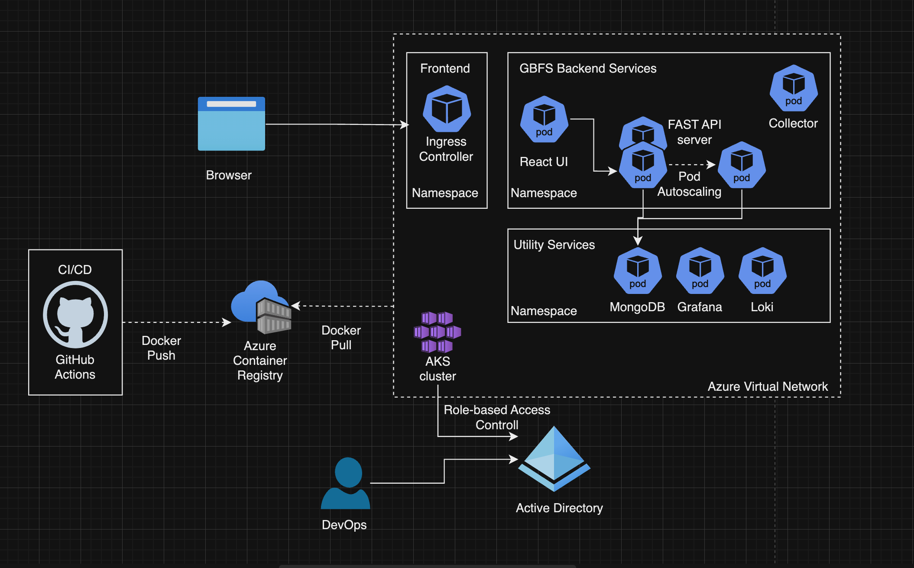

# Architecture Overview

## High-Level Architecture Diagram

### Components:

- **Frontend**: React application served by Nginx.
- **Backend**: FastAPI server that handles API requests and data processing.
- **Collector**: A Python-based service that fetches and processes data from the GBFS feeds.
- **Database**: MongoDB for storing processed data and stats.
- **Kubernetes**: Orchestration platform to manage containerized applications.

## Components Description

### Frontend (React)

**Description**: The frontend is built using React and provides a user interface for displaying bike-sharing statistics.

**Responsibilities**:
- Fetch data from the backend API.
- Render the dashboard with vehicle statistics.
- Handle user interactions.

### Backend (FastAPI)

**Description**: A FastAPI server acts as the bridge between the frontend and the database, handling API requests.

**Responsibilities**:
- Provide RESTful APIs to the frontend for fetching data.
- Process requests for statistics and historical data.
- Interface with the MongoDB database to store and retrieve data.

### Collector (Python Script)

**Description**: A scheduled Python script that collects data from GBFS feeds at defined intervals.

**Responsibilities**:
- Fetch data from the GBFS provider URLs.
- Extract relevant statistics (e.g., number of available vehicles).
- Store extracted data in MongoDB.

### Database (MongoDB)

**Description**: MongoDB is used to store the collected bike-sharing data.

**Responsibilities**:
- Persist collected statistics for historical analysis.
- Provide efficient queries to the FastAPI backend.

### Kubernetes

**Description**: Kubernetes is used to orchestrate the deployment of all services.

**Responsibilities**:
- Manage container lifecycle (scaling, restarting, etc.).
- Run the collector as a CronJob.
- Expose services to the external network.

## Data Flow

### Data Collection:

- The Collector service runs on a schedule (Kubernetes CronJob) and fetches data from the GBFS feeds.
- The Collector extracts relevant statistics and saves them to MongoDB.

### Data Retrieval:

- The React frontend makes API calls to the FastAPI backend to retrieve statistics.
- FastAPI queries MongoDB for the requested data and responds to the frontend.

### User Interaction:

- Users interact with the frontend to view bike-sharing statistics, which are dynamically fetched from the backend.

## Deployment Overview

### Technologies Used

- **Frontend**: React, Nginx
- **Backend**: FastAPI
- **Database**: MongoDB
- **Containerization**: Docker
- **Orchestration**: Kubernetes

### Deployment Components

- **Docker**: Each service is containerized using Docker, allowing for consistent environments.
- **Kubernetes**: Manages deployment, scaling, and service discovery across the different components.

## Considerations for Future Enhancements

### Observability
- **Alerts**: Implementing alerting mechanisms for anomalies in bike-sharing statistics. Integrate it with slack
- **Logging**: Configure persistance for log storage. Explore cheaper blob storage kind of options to store logs.
- **Health Endpoints**: Create health and readiness endpoints

### Business features
- **Enhanced Dashbaords**: Enhanced dashboards with more features like historical data and trend.

### Config and secrets management
- **Configurability**: Allowing users to configure different GBFS providers dynamically.
- **Secrets Manager**: Implement secret manager to hold secrets required for apps. For example - DB creds. One option could be azure keyvault.

### Security
- **TLS**: Setup TLS termination at ingress and have redirect rule to serve only on 443
- **Static code analysis**: Setup static code analysis in CI pipeline
- **Container security scanning**: Setup container security scaning at pipeline level or at container repo level.
- **Runtime security monitoring**: Setup tools like falco to actively monitor security threats

### CICD
- **GitOps**: Implement gitops for shipping changes seemlessly on all environments.
- **UnitTests**: Write unit tests. Show test reports on pipeline.

### Other
- **Persistant storage**: Implement persistant storage for mongodb running on kubernetes.

